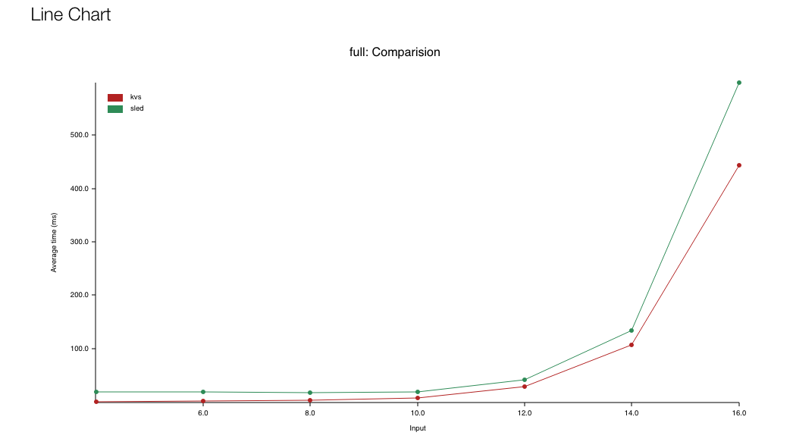
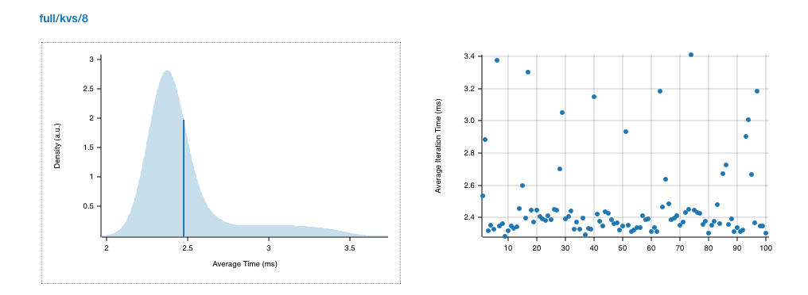
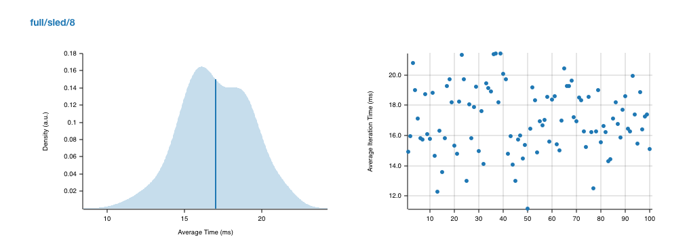
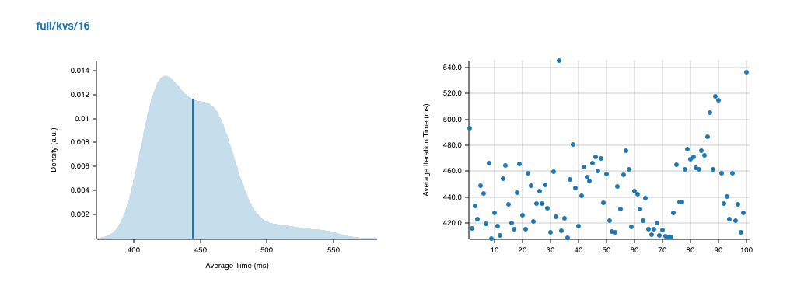
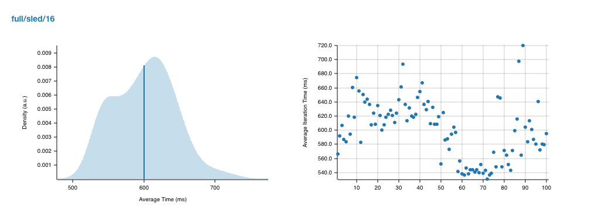

<p align="center">
    
</p>
<p align="center">
    A multi-threaded, persistent key/value store server and client with networking over a custom protocol.
</p>

## Quick start

- Build: `cargo build`
- Run server: `./target/release/kvs-server -h`
  ```
  kvs-server 0.1.0

  USAGE:
      kvs-server [OPTIONS]

  FLAGS:
      -h, --help       Prints help information
      -V, --version    Prints version information

  OPTIONS:
          --addr <IP:PORT>          Sets the listening address [default: 127.0.0.1:4000]
          --engine <ENGINE-NAME>    Sets the storage engine [possible values: kvs, sled]
  ```
- Run client: `./target/release/kvs-client -h`
  ```
  kvs-client 0.1.0

  USAGE:
      kvs-client <SUBCOMMAND>

  FLAGS:
      -h, --help       Prints help information
      -V, --version    Prints version information

  SUBCOMMANDS:
      get    Get the string value of a given string key
      rm     Remove a given string key
      set    Set the value of a string key to a string
  ```

## Features

- WIP

## Benchmark

Compared with [sled](https://github.com/spacejam/sled) (a concurrent embedded kv database), `kvs` engine takes samller space and offers faster speed. The benchmark results are as follows:

<br/>








## Testing
`cargo test --test cli`
- [x] server_cli_version
- [x] client_cli_version
- [x] client_cli_no_args
- [x] client_cli_invalid_subcommand
- [x] test client_cli_invalid_get
- [x] client_cli_invalid_rm
- [x] client_cli_invalid_set
- [x] cli_log_configuration
- [x] cli_wrong_engine
- [x] cli_access_server_kvs_engine
- [x] cli_access_server_sled_engine

`cargo test --test kv_store`
- [x] remove_non_existent_key
- [x] remove_key
- [x] get_non_existent_value
- [x] get_stored_value
- [x] overwrite_value
- [x] concurrent_get
- [x] concurrent_set
- [x] compaction

`cargo test --test thread_pool`
- [x] naive_thread_pool_spawn_counter
- [x] shared_queue_thread_pool_spawn_counter
- [x] rayon_thread_pool_spawn_counter
- [x] shared_queue_thread_pool_panic_task

<br />

> Thanks to https://github.com/pingcap/talent-plan
